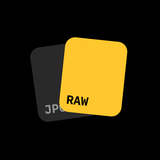
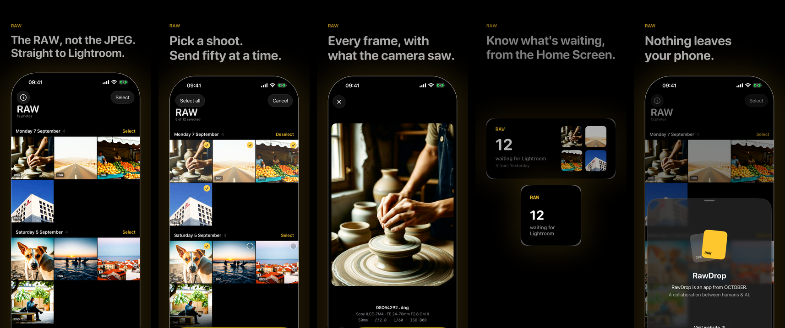

<p align="center">
  
</p>

<h1 align="center">RawDrop</h1>

<p align="center">
  The RAW your camera shot, straight to Lightroom.<br>
  A small, fast iOS app that finds the RAW files Photos keeps behind the JPEG and hands them to Lightroom.
</p>

<p align="center">
  <a href="https://testflight.apple.com/join/q3zysdPW"></a>
  <a href="https://github.com/heyimjames/rawdrop/stargazers"></a>
</p>

<p align="center">
  
  
  
  <a href="LICENSE"></a>
</p>

<p align="center">
  
</p>

## The problem

When you import a RAW+JPEG shoot from a camera into Photos, each photo becomes one asset with two files inside it. The JPEG is the primary. The RAW is stored as an alternate. Any app that asks Photos for "the image" gets the JPEG, and that includes Lightroom's import. Your RAWs are on your phone, but nothing can reach them.

## What RawDrop does

RawDrop reaches past the primary. It reads the RAW resource out of each asset with PhotoKit, writes it to a temporary file with its original camera filename, and hands the batch to Lightroom through the standard iOS share sheet.

- Every photo with a RAW inside it, grouped by day, or narrowed to an album from the title menu
- Tap to open a photo, flick through the shoot, mark keepers by thumb, send
- Select mode with tap and sweep, exactly as Photos does it
- Sends up to 50 at a time, which is Lightroom's limit; pick more and the button turns red and trims to your first 50
- Remembers what has already been sent, so the next shoot is "Select new" and one tap
- Viewer shows the body, lens and exposure of every frame, read from the file's own EXIF
- Home and Lock Screen widgets showing how many RAWs are waiting, tapping straight into select mode
- Nothing leaves the phone. No account, no analytics, no servers

Works with ARW, RAF, CR2, CR3, NEF, DNG, ORF, RW2, PEF and the rest. If Photos calls it RAW, RawDrop finds it.

## Get it

- **TestFlight**: [join the beta](https://testflight.apple.com/join/q3zysdPW)
- **App Store**: coming soon

If it saves you a Files-app export dance, a star on this repo is the nicest way to say so.

## Build it yourself

Requires Xcode 26 and [xcodegen](https://github.com/yonaskolb/XcodeGen).

```sh
git clone https://github.com/heyimjames/rawdrop.git
cd rawdrop
xcodegen generate
open RawDrop.xcodeproj
```

Set your own team in `project.yml` and change the App Group identifier in both entitlements files. Debug builds accept a few launch arguments for reaching screens on a simulator without tapping: `-open-viewer`, `-select-mode`, `-show-about`, `-preview-widgets`, `-fake-library 50000`.

## How it works

| Piece | Where |
| --- | --- |
| Finding RAWs fast: Photos' own RAW smart album instead of scanning every asset | `RawDrop/Library/RawLibrary.swift` |
| Picking the RAW resource out of an asset by UTI, then extension | `RawDrop/Library/RawResolver.swift` |
| Streaming the RAW to disk with real cancellation | `RawDrop/Library/RawExporter.swift` |
| Reading EXIF from the first few hundred KB of the JPEG | `RawDrop/Library/ShotInfo.swift` |
| One motion vocabulary for the whole app | `RawDrop/UI/Motion.swift` |
| Direction-gated pan so sweep-select never fights scrolling | `RawDrop/UI/DirectionalPan.swift` |
| The two Metal shaders: a sweep on the extracting tile, a glint on the RAW card | `RawDrop/UI/Sweep.metal` |
| Widget snapshot written by the app, read by the extension | `Shared/WidgetSnapshot.swift` |

## Privacy

RawDrop collects nothing. The full policy is one page: [rawdrop-heyimjames-projects.vercel.app/privacy](https://rawdrop-heyimjames-projects.vercel.app/privacy).

## Made by

[OCTOBER](https://octoberwip.com), a design studio in Lisbon. A collaboration between humans & AI.
